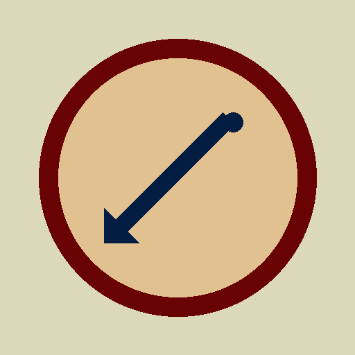

<a id="readme-top"></a>

[![MIT License][license-shield]][license-url]
[![Hugo][hugo-shield]][hugo-url]
[![Netlify Status][netlify-shield]][netlify-url]

<br />
<div align="center">
  <a href="https://github.com/K0Stek122/fp-enthusiast-hugo-theme">
    
  </a>

  <h3 align="center">FP Enthusiast</h3>

  <p align="center">
    A cosy, centred, single-column reading theme for Hugo — warm paper palette,
    editorial serif display, SEO-complete, and near-zero JavaScript.
    <br />
    <a href="#usage"><strong>Explore the docs »</strong></a>
    <br />
    <br />
    <a href="https://fp-enthusiast-hugo-theme.netlify.app">View Demo</a>
    &middot;
    <a href="https://github.com/K0Stek122/fp-enthusiast-hugo-theme/issues/new?labels=bug">Report Bug</a>
    &middot;
    <a href="https://github.com/K0Stek122/fp-enthusiast-hugo-theme/issues/new?labels=enhancement">Request Feature</a>
  </p>
</div>

<details>
  <summary>Table of Contents</summary>
  <ol>
    <li><a href="#about-the-project">About The Project</a></li>
    <li><a href="#built-with">Built With</a></li>
    <li>
      <a href="#getting-started">Getting Started</a>
      <ul>
        <li><a href="#prerequisites">Prerequisites</a></li>
        <li><a href="#installation">Installation</a></li>
      </ul>
    </li>
    <li><a href="#usage">Usage</a></li>
    <li><a href="#roadmap">Roadmap</a></li>
    <li><a href="#contributing">Contributing</a></li>
    <li><a href="#license">License</a></li>
    <li><a href="#contact">Contact</a></li>
    <li><a href="#acknowledgments">Acknowledgments</a></li>
  </ol>
</details>

## About The Project

[![FP Enthusiast screenshot][product-screenshot]](https://fp-enthusiast-hugo-theme.netlify.app)

**FP Enthusiast** is a Hugo theme for a personal notebook-style blog. It grew out
of a hand-built HTML mockup for a fountain-pen journal and keeps that design's
priorities:

- **Centred and calm.** One column, a ~40rem reading measure, and a nav you never
  have to hunt through. Inspired by the layouts of Hermit, hugo-blog-awesome, and
  hugo-coder.
- **Warm paper palette.** A five-colour system — paper, tan, olive, navy, wine —
  with a derived dark set that follows `prefers-color-scheme` and a small manual
  toggle on top.
- **Bold, clear shapes.** A short navy rule, square list markers, a wine
  blockquote bar — geometric accents that stay out of the way of the text.
- **SEO as a pass/fail gate.** Canonical URLs, a full Open Graph + Twitter set,
  per-page JSON-LD (`WebSite` / `Person` / `BlogPosting` / `BreadcrumbList`),
  RSS, `sitemap.xml`, and context-aware `robots.txt`.
- **Near-zero JavaScript.** The only script is a ~15-line dark-mode toggle plus a
  tiny inline no-FOUC snippet — both deferred and fingerprinted. No framework, no
  bundler, no CDN requests. Fonts are self-hosted woff2.

<p align="right">(<a href="#readme-top">back to top</a>)</p>

## Built With

* [Hugo Extended](https://gohugo.io/) (≥ 0.158)
* [Fraunces](https://github.com/undercasetype/Fraunces) — display serif (SIL OFL 1.1)
* [Inter](https://github.com/rsms/inter) — body sans (SIL OFL 1.1)
* No JS framework, no build step beyond `hugo`

<p align="right">(<a href="#readme-top">back to top</a>)</p>

## Getting Started

### Prerequisites

* **Hugo Extended ≥ 0.158.** The theme uses Hugo Pipes for CSS/JS.

  ```sh
  hugo version   # must contain "extended"
  ```

### Installation

**As a Git submodule**

```sh
git submodule add https://github.com/K0Stek122/fp-enthusiast-hugo-theme themes/fp-enthusiast
```

**As a Hugo Module** (in your site's `hugo.toml`)

```toml
[module]
  [[module.imports]]
    path = "github.com/K0Stek122/fp-enthusiast-hugo-theme"
```

```sh
hugo mod get github.com/K0Stek122/fp-enthusiast-hugo-theme
```

**Plain clone**

```sh
git clone https://github.com/K0Stek122/fp-enthusiast-hugo-theme themes/fp-enthusiast
```

Then set `theme = "fp-enthusiast"` in your site config.

<p align="right">(<a href="#readme-top">back to top</a>)</p>

## Usage

Copy the example configuration and start writing:

```sh
cp -r themes/fp-enthusiast/exampleSite/* .
hugo server
```

**Key params** (`hugo.toml`):

```toml
[params]
  description    = "One sentence for meta + JSON-LD."
  tagline        = "Sits under the H1 on the home page."
  author         = "Your Name"
  email          = "you@example.com"     # footer Contact link
  mainSections   = ["posts"]
  dateFormat     = "2 January 2006"
  titleSeparator = "·"
  footerText     = "Markdown allowed."
```

Add a menu and a taxonomy:

```toml
[menus]
  [[menus.main]]
    name = "Notes"
    pageRef = "/posts"
    weight = 20

[taxonomies]
  tag = "tags"
```

**Post front matter.** A `cover` (page resource or path) drives the Open Graph
image and the JSON-LD `image`. Undated pages (e.g. `about.md`) are rendered as
`WebPage` with no date stamps.

**Dark mode.** Automatic via `prefers-color-scheme`; the header button adds a
manual override stored in `localStorage`. Remove the button from
`layouts/_partials/header.html` and the two script lines from
`layouts/_partials/head.html` + `layouts/baseof.html` for a zero-JS build.

<p align="right">(<a href="#readme-top">back to top</a>)</p>

## Roadmap

- [ ] Optional syntax highlighting stylesheet pair (light/dark)
- [ ] Series / collection navigation
- [ ] Per-post table of contents partial (opt-in)

See the [open issues](https://github.com/K0Stek122/fp-enthusiast-hugo-theme/issues) for the
full list.

<p align="right">(<a href="#readme-top">back to top</a>)</p>

## Contributing

Contributions are welcome. Fork the repo, create a feature branch
(`git checkout -b feature/thing`), commit, push, and open a Pull Request. Please
run `hugo --gc --minify --source exampleSite` and confirm a clean build with no
`WARN` lines before submitting.

<p align="right">(<a href="#readme-top">back to top</a>)</p>

## License

Distributed under the MIT License. See [`LICENSE`](LICENSE) for details.

The bundled **Fraunces** and **Inter** typefaces are licensed under the SIL Open
Font License 1.1; their license texts are in `static/fonts/`.

<p align="right">(<a href="#readme-top">back to top</a>)</p>

## Contact

Project Link: [https://github.com/K0Stek122/fp-enthusiast-hugo-theme](https://github.com/K0Stek122/fp-enthusiast-hugo-theme)

Maintainer: [@K0Stek122](https://github.com/K0Stek122)

<p align="right">(<a href="#readme-top">back to top</a>)</p>

## Acknowledgments

* [Best-README-Template](https://github.com/othneildrew/Best-README-Template)
* [Hermit-V2](https://github.com/1bl4z3r/hermit-V2), [hugo-blog-awesome](https://github.com/hugo-sid/hugo-blog-awesome), and [hugo-coder](https://github.com/luizdepra/hugo-coder) for the centred-reading inspiration
* [Fontsource](https://fontsource.org/) for the self-hostable font files

<p align="right">(<a href="#readme-top">back to top</a>)</p>

[license-shield]: https://img.shields.io/github/license/K0Stek122/fp-enthusiast-hugo-theme.svg?style=for-the-badge
[license-url]: https://github.com/K0Stek122/fp-enthusiast-hugo-theme/blob/main/LICENSE
[hugo-shield]: https://img.shields.io/badge/Hugo-0.158+-ff4088?style=for-the-badge&logo=hugo&logoColor=white
[hugo-url]: https://gohugo.io/
[netlify-shield]: https://img.shields.io/badge/deploy-netlify-00c7b7?style=for-the-badge&logo=netlify&logoColor=white
[netlify-url]: https://fp-enthusiast-hugo-theme.netlify.app
[product-screenshot]: images/screenshot.png
