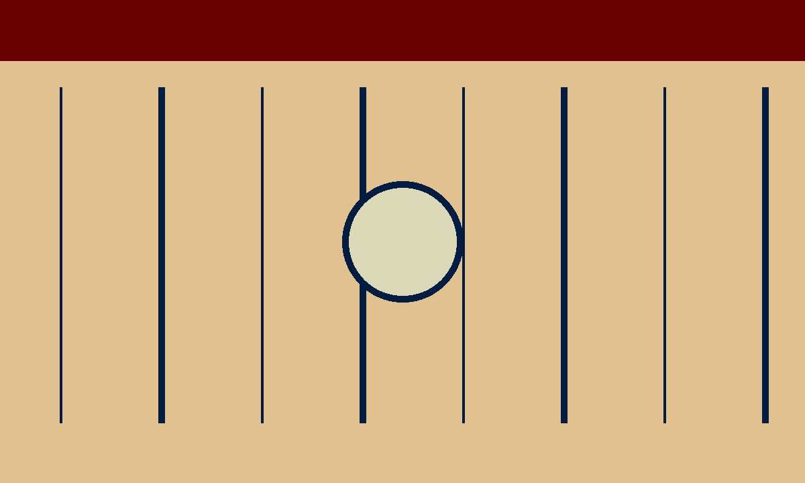

+++
date = 2026-09-02T09:00:00Z
lastmod = 2026-09-05T09:00:00Z
draft = false
title = "Why I keep going back to iron gall ink"
description = "It stains, it corrodes nibs if you let it, and I still can't quit it — here's why."
tags = ["inks"]
cover = "cover.png"
+++

Every few months I tell myself I'm done with it. It stains my fingers, it can eat
a badly-chosen nib if you neglect a pen for too long, and cleaning it out of a
converter is never a five-minute job. And every few months, I fill a pen with it
anyway.

Part of it is the line. Iron gall ink goes down grey-blue and wet, then spends
the next hour oxidising into something darker and more permanent on the page.
Watching a page of notes deepen in colour over an afternoon is a small, quiet kind
of satisfaction that a dye-based ink just doesn't offer.



## What actually happens chemically

The short version: iron salts react with gallotannic acid to form a compound
that's nearly colourless when wet and oxidises to a dark, water-fast black-blue
once exposed to air. That's also why it has a reputation — left uncleaned in a pen
for months, the same reaction that darkens your writing can quietly work on steel.

> The ink that ruins nibs is also the ink that outlives everything else in the drawer.

In practice, modern formulations are far gentler than their nineteenth-century
ancestors, and a pen that gets flushed every few weeks has nothing to worry about.
I've run it through three different steel-nib pens for over a year now without a
single issue.

### My flushing routine

Nothing elaborate — a bulb syringe, cool water, and a note in my task list so I
don't forget:

```
every 3 weeks:
  1. empty the converter
  2. flush with cool water until it runs clear
  3. one flush with a drop of dish soap
  4. final clear-water flush, then dry overnight nib-up
```

## Which pen I'd actually recommend it in

Stick to a pen with a steel nib you don't mind cleaning often, and avoid anything
with tight tolerances or an ebonite feed you can't easily flush. A simple
cartridge-converter pen is the easiest place to start — nothing precious, nothing
you'll be nervous about.

| Ink                     | Wetness | Dry time | Water-fast |
| ----------------------- | ------- | -------- | ---------- |
| Rohrer & Klingner Salix | Medium  | ~15 s    | Yes        |
| KWZ Iron Gall Blue #4   | Wet     | ~20 s    | Yes        |
| Diamine Registrar's     | Dry     | ~10 s    | Yes        |

If you've never tried it, start with a smaller bottle and read the
[Rohrer & Klingner care notes](https://www.rohrer-klingner.de/) first. It's not an
ink you fall in love with by the first page — it's one that grows on you by the
twentieth.
